## Linkit

- [Sovellukseen ja backend sovellukseen](https://valita.northeurope.cloudapp.azure.com/)
- [API-dokumentaatioon](https://users.metropolia.fi/~thitng/valita-apidoc/)

## Linkki ohjelmistotestauskansioon

[Unit test](https://github.com/emintt/Valita/blob/main/__tests__/Create.test.tsx)
[End-to-end test](https://github.com/emintt/Valita/tree/main/cypress/e2e)

## CI/CD putki

[Linkki](https://github.com/emintt/Valita/tree/main/.github/workflows)
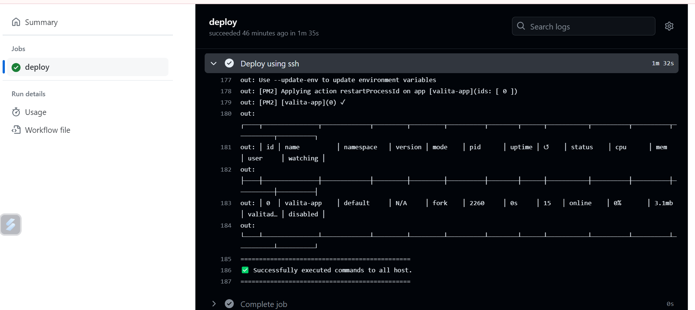

## Tietokannan kuvaus

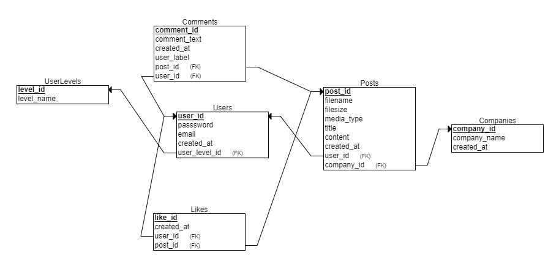

## Sovelluksen käyttöliittymä

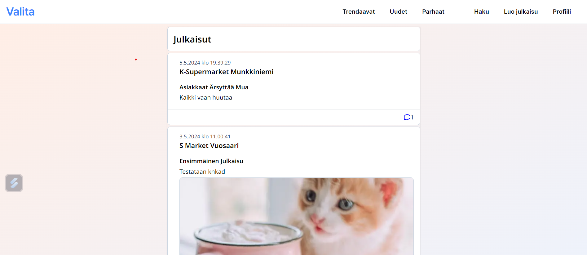
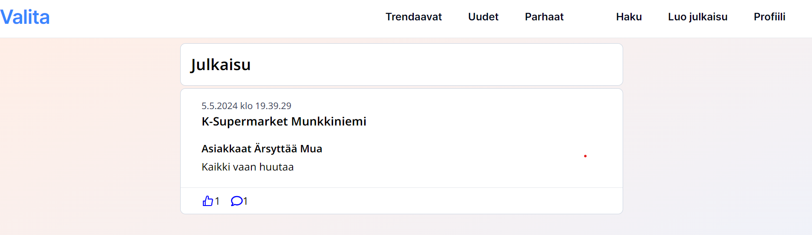

## Toiminnallisuudet
- Rekisteröityminen
- Kijautuminen
- Kirjautuminen ulos
- Yrityksen hakeminen
- Julkaisun luominen, kuva voi liittää julkaisuun valinnaisesti
- Julkaisun poistaminen
- Julkaisun poistaminen (admin)

- Rekisteröityminen
  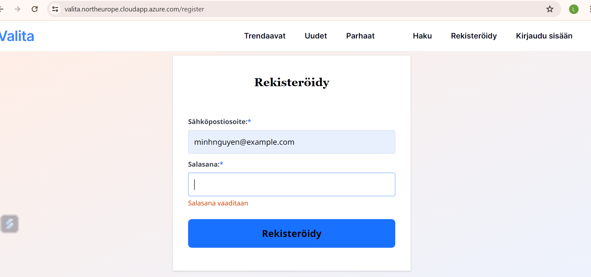

- Kijautuminen
  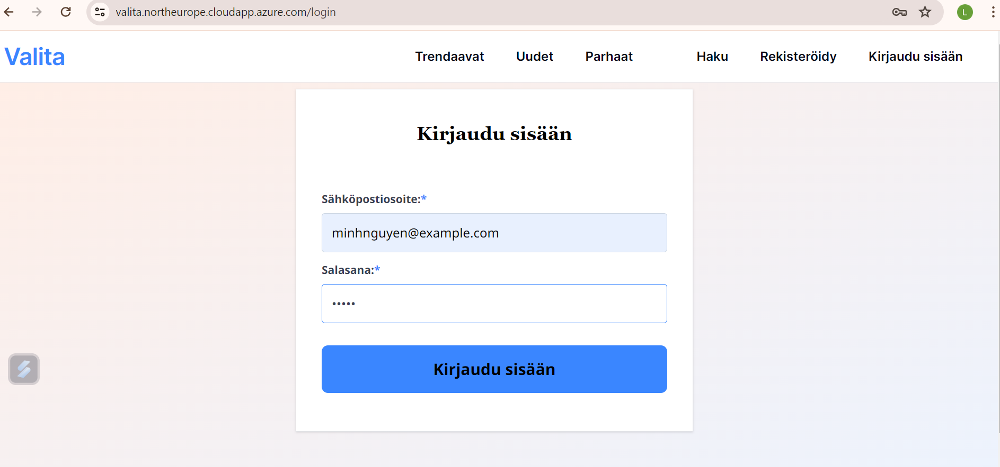

- Kirjautuminen ulos
  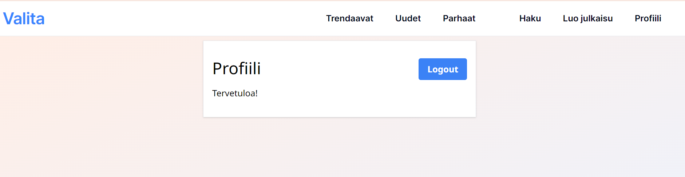

- Yrityksen hakeminen
  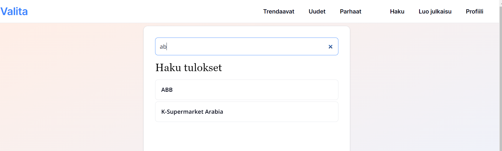

- Julkaisun luominen, kuva voi liittää julkaisuun valinnaisesti
  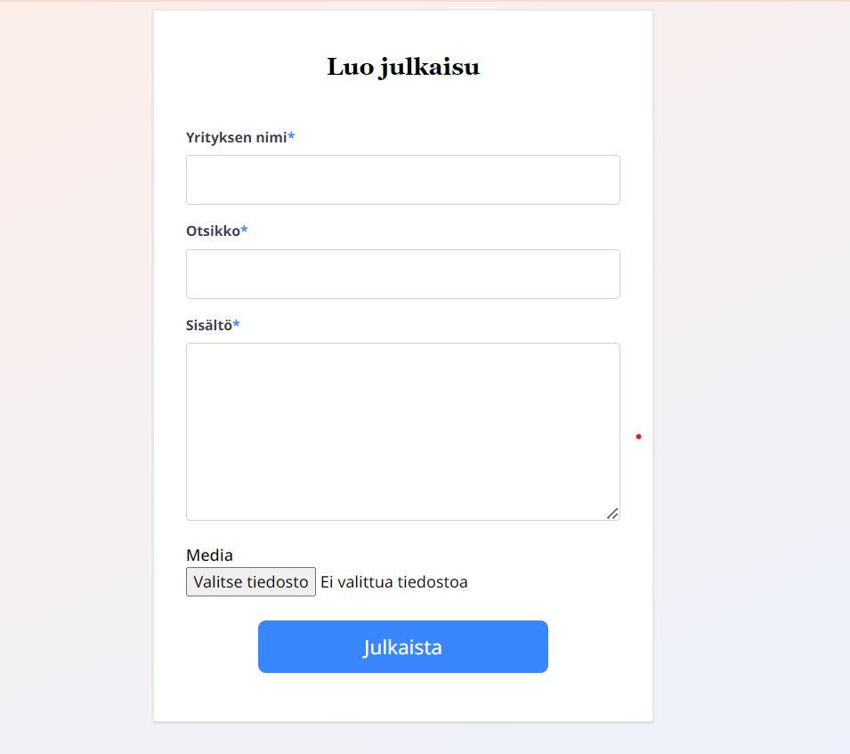

- Julkaisun poistaminen
  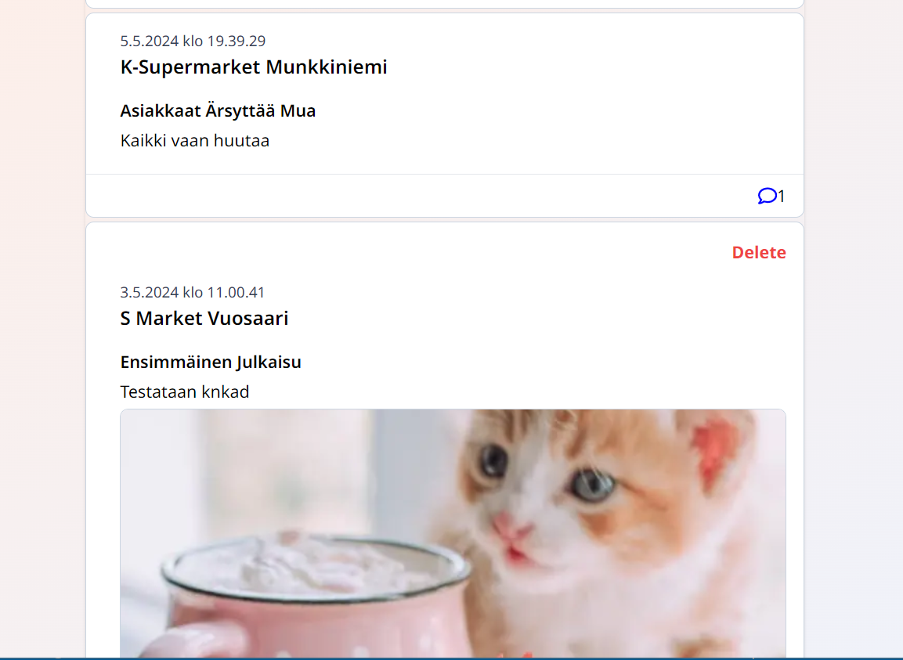

- Julkaisun poistaminen (admin)
  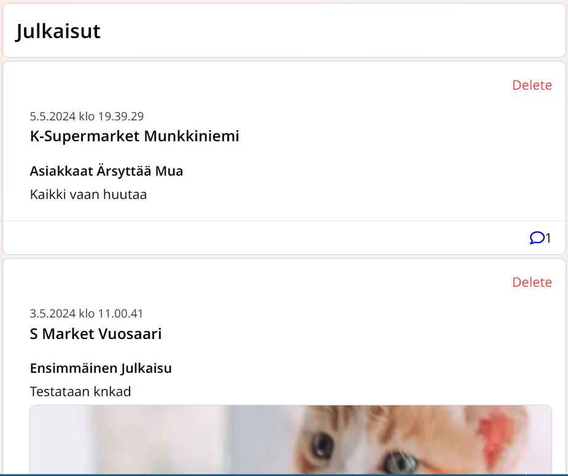

## Referenssit

https://github.com/ilkkamtk/hybridisovellukset
